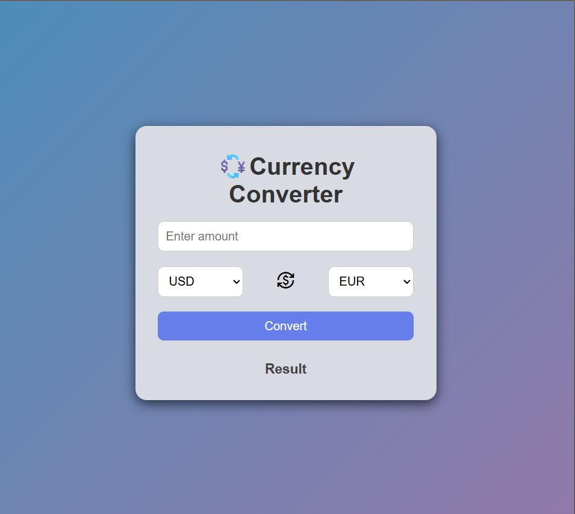

# Mudra (Currency Converter)

Welcome to Mudra – Currency Converter!
I built this project to make dealing with different currencies super easy for everyone. With Mudra, you don’t need to hunt for exchange rates or do any math yourself. Just type in the amount, pick the currencies you want, and instantly see how much you’ll get.

I’ve tried to keep the design simple and user-friendly, so it’s quick to use whether you’re planning a trip, shopping online, or just curious about exchange rates. The app uses real-time rates to stay accurate. If you ever felt confused by currency conversions, Mudra is here to help and make the process smooth.

Feel free to try it out.
Money conversion is now easy and hassle free using Mudra.

### Features
  - Instant currency conversion: Get real-time results as soon as you hit convert.
  - Simple interface: Intuitive layout makes it easy for anyone to use.
  - Multiple currencies: Easily switch and convert between popular world currencies.
  - Live exchange rates: Ensures your conversions are always accurate and up-to-date.
  - Responsive design: Looks great and works smoothly on any device.

### Screenshot

### Installation
  1. Clone the repo
  2. Open `index.html` in your browser
